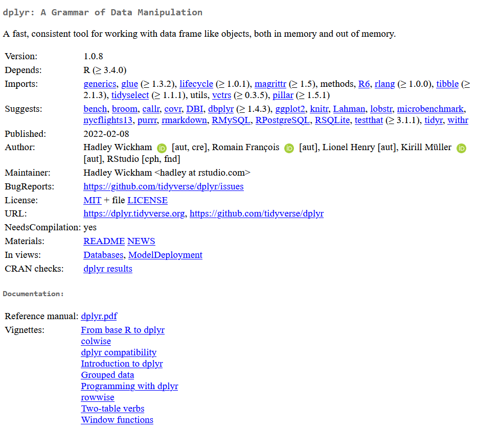
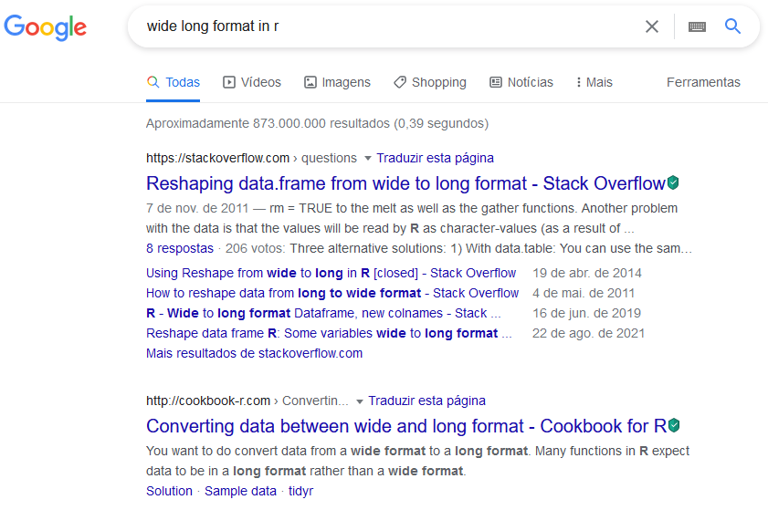
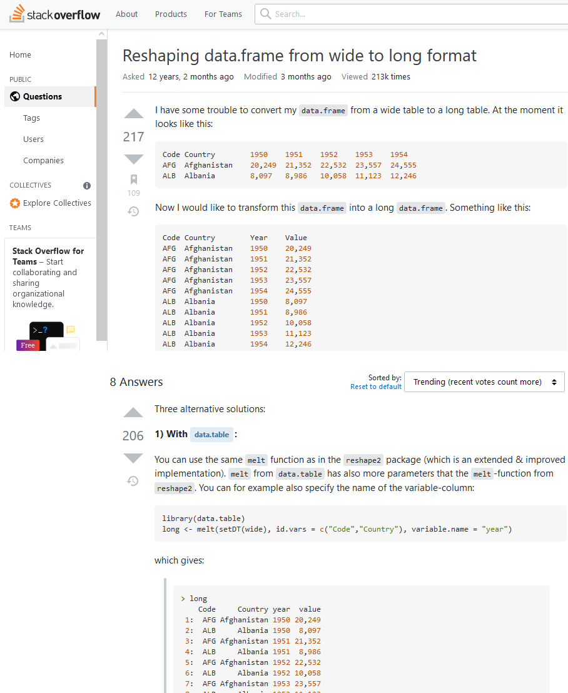

```{r setup, include=FALSE}
knitr::opts_chunk$set(echo = TRUE)
```

- Baseado, principalmente, nos cursos da [_Especialização em Data Science_](https://www.coursera.org/specializations/jhu-data-science) da universidade John Hopkins (disponível no Coursera).
- Em cada tema abordado serão citadas as fontes, além de incluir aos vídeos dos cursos citados acima para que possam aprofundar nos estudos.
- Alunos USP conseguem fazer determinados cursos/especializações e pegar o certificado sem pagar: [_Universidade de São Paulo BR on Coursera_](https://www.coursera.org/programs/universidade-de-sao-paulo-br-on-coursera-mvxtw?currentTab=CATALOG&fbclid=IwAR3dT_SDYfjT2FWH06mUcSb8V_z4F9aT_1c6MHHQ3gdiDQ9X9mdRhMcsbOk)


## Installing R
- [Installing R (John Hopkins/Coursera)](https://www.coursera.org/learn/data-scientists-tools/lecture/y6mU2/installing-r)

1. Instalação da base do R ([CRAN](https://cran.r-project.org))
    - Download R for Windows > base > Download R X.X.X for Windows
    - Se o computador for 64-bits, opte pela versão 64-bits (é mais rápida)

2. Instalação do Rtools ([CRAN](https://cran.r-project.org))
    - Download R for Windows > Rtools > Installing Rtools > rtools40-x86_XX.exe
    - É um conjunto de ferramentas de compilação de várias linguagens (C, C++ e Fortran) que são necessários em alguns pacotes no R

3. Instalação do RStudio ([RStudio Dowload](https://www.rstudio.com/products/rstudio/download/#download))
    - Download RStudio Desktop
    - É uma interface de usuário para facilitar o uso do R

## Using R Studio
- [RStudio Tour (John Hopkins/Coursera)](https://www.coursera.org/learn/data-scientists-tools/lecture/0fUNC/rstudio-tour)

RStudio é dividido em 4 quadrantes:

- superior/esquerdo: source - onde ficam "blocos de nota" (scripts) com comandos a serem salvos
- superior/direito: ambiente - visualizar variáveis
- inferior/esquerdo: console - executar os comandos e ver resultados (é o R "bruto")
- inferior/direito: arquivos/gráficos/pacotes/ajuda

> **Dica**: Alterar o tema do RStudio (fundo branco pode cansar mais a visão num tempo mais longo)<br/>  
Tools > Global Options... > Appearance > Editor theme > Cobalt (meu preferido)

### Diretório de trabalho (_Working Directory_)
Definir um diretório de trabalho facilita o acesso aos arquivos da pasta (base de dados, etc.).

> Session > Set Working Directory > Choose Directory...

```r
setwd("C:/Users/Fabio/OneDrive/FEA-RP")
```

> **Dica**: O comando para definir o diretório de trabalho aparecerá no console. Copie e cole no seu script para não precisar definir toda vez que abre o R Studio.

- Note que usa o "slash" (/) ao invés do "backslash" (\\), então não dá para copiar diretamente o endereço de uma pasta e colar no R sem fazer ajustes:
```r
setwd("C:\Users\Fabio\OneDrive\FEA-RP") # ERRADO!
```

```r
setwd("C:/Users/Fabio/OneDrive/FEA-RP") # CORRETO!
setwd("C:\\Users\\Fabio\\OneDrive\\FEA-RP") # CORRETO!
```

Você pode trocar _backslash_ por _slash_, ou duplicar os _backslashs_.

### Executando comandos no R
- Execução direta no console: escreva `1 + 1` no console e dê \<Enter\>
```{r}
1 + 1
```
- Execução pelo script: escreva o seguinte código abaixo, e dê `Ctrl + Enter` na linha ou no código destacado. Note que o código do script é "jogado" no console.
```{r}
rnorm(n=10, mean=0, sd=1)  # Gerar 10 números ~ N(0, 1)
hist(rnorm(n=1000, mean=0, sd=1))  # Histograma dos números gerados
```


### Ajuda para comandos
```r
?rnorm
```

```yaml
rnorm(n, mean = 0, sd = 1)

n: number of observations. If length(n) > 1, the length is taken to be the number required.
mean: vector of means.
sd: vector of standard deviations.
```

- Note acima em "Usage" que já há valores pré-definidos para `mean = 0` e `sd = 1`. Portanto, se você só informar o `n`, a função irá funcionar, considerando os valores pré-definidos para os demais argumentos.
- É possível escrever o código sem os nomes dos argumentos, mas devem ser inseridos na mesma ordem do descrito na Ajuda.
```r
rnorm(10, 0, 1)
```
- Também podemos trocar a ordem explicitando o nome do argumento (NÃO RECOMENDADO)
```r
rnorm(mean=0, n=10, sd=1)
```


## R Packages
- Pacotes são coleções de funções, dados e códigos escritos por outras pessoas
- Por ser um software _open source_, o R possui muitos pacotes disponibilizados pela internet e muitos economistas (principalmente econometristas) já desenvolvem e disponibilizam pacotes com as implementações de seus novos métodos (por exemplo, Dif-in-Dif com múltiplos períodos de [Callaway e Sant'Anna (2021)](https://bcallaway11.github.io/did/articles/did-basics.html)
- A instalação de um pacote só precisa ser feita uma única vez.
- No entanto, caso você atualize uma nova versão do R, é necessário instalar novamente todos os pacotes.
- Os pacotes podem ser obtidos em bibliotecas (_libraries_), como CRAN, e de indivíduos (normalmente disponibilizados no GitHub)
- O CRAN é administrado e, como existe uma curadoria para inserção e manutenção de pacotes novos e defasados, garante qualidade dos pacotes disponibilizados
- Tome cuidado com pacotes disponibilizados por individuos! É possível executar, dentro do R, códigos para criar e apagar arquivos, por exemplo.

### Instalação via CRAN
> quadrante inferior/direito > Packages > Install > (Nomes dos pacotes)

```r
install.packages("ggplot2") # Pacote para criar graficos
```

### Instalação via GitHub
- Primeiro, é necessário instalar o pacote `devtools`
```r
install.packages("devtools")
```
- Depois, é preciso obter o nome do author (do GitHub) e nome do pacote. Como exemplo, iremos baixar o pacote `dplyr` do autor `hadley` (este pacote, na realidade, pode ser baixado direto do CRAN).
- Para executar uma função de um pacote, podemos usar `<pacote>::<funcao>`
```r
devtools::install_github("hadley/dplyr")
```

- Ou é possível carregar o pacote no ambiente e, depois, chamar a função do pacote carregado
```r
library(devtools)
install_github("hadley/dplyr")
```

- CUIDADO! Ao carregar varios pacotes, talvez tenha 2 funções com mesmo nome
    - R prioriza a função do pacote carregado por último
```{r}
library(dplyr) # Pacote para manipulacao de base de dados
library(MASS) # Normalmente nao eh carregado diretamente (via outro pacote)
```

- Uma forma de contornar o problema é usar `<pacote>::<funcao>`
```r
select(obj) # do pacote MASS
dplyr::select(.data, ...) # do pacote dplyr
```

### Atualizando pacotes
> quadrante inferior/direito > Packages > Update > Select All > Install Updates


## Help
- Caso saiba o nome da função, é possível olhar sua documentação escrevendo `?<nome_da_funcao>` (como visto anteriormente)
- Caso saiba o nome do pacote, em alguns casos funciona `?<nome_do_pacote>`, mas o ideal é buscar sua documentação no CRAN (diretamente no site ou via Google)
    - Por exemplo, podemos acessar a página do [pacote `dplyr` no CRAN](https://cran.r-project.org/web/packages/dplyr/index.html):
<center></center>
    - Nela é possível ver a partir de qual versão do R funciona, os pacotes necessários para o seu funcionamento (Imports), os autores e sites.
    - Em Documentação, é possível ver o seu 'Reference manual' onde são expostos o objetivo do pacotes e as funções, incluindo explicações de seu funcionamento.
    - Além disso, pode ser interessante ver aplicações do pacote e suas funções nas 'vignettes'. Normalmente são expostas de maneira que podem ser replicadas no seu computador, o que acaba auxiliando na sua aplicação (verificar estrutura de base de dados necessária, sintaxes, etc.). Também pode ser acessada diretamente do R usando a função `browseVignettes()`:
```r
browseVignettes("dplyr") # Abrirá uma página com vignettes no seu navegador
```

- Caso não saiba quais funções/pacotes são utilizados para resolver um problema, muitas vezes é possível encontrar a solução no Google utilizando palavras-chave (preferencialmente em inglês) junto de "R".
<center></center>
    - Além de sites especializados em R e vídeos com exemplos de aplicações, é comum aparecer questões no site Stack Overflow (ou em Cross Validated, pertencente ao mesmo grupo) que é o site mais utilizado por programadores em diversas linguagens para esclarecer dúvidas.
    - Por R ser uma linguagem open source, há muitos usuários e, portanto, é comum achar perguntas/respostas que já solucionam o seu problema. Eventualmente, você pode fazer a sua pergunta, caso não encontre uma satisfatória.
<center></center>


## GitHub Sync
Não será detalhado aqui, mas é algo interessante para olhar.

- [Criação de projetos](https://www.coursera.org/learn/data-scientists-tools/lecture/2o9zr/projects-in-r)
- [Controle de versão](https://www.coursera.org/learn/data-scientists-tools/lecture/PjlHw/version-control)
- [GitHub e Git](https://www.coursera.org/learn/data-scientists-tools/lecture/VOh24/github-and-git)
- [Projetos sob controle de versões](https://www.coursera.org/learn/data-scientists-tools/lecture/wbfrX/projects-under-version-control)


## R Markdown
Markdown é uma sintaxe de formatação simples para criar documento HTML, PDF ou Word.

Para mais detalhes de uso, veja:

- [R Markdown (John Hopkins/Coursera)](https://www.coursera.org/lecture/data-scientists-tools/r-markdown-134kE)
- Curso [_Reproducible Templates for Analysis and Dissemination_ (Emory/Coursera)]( https://www.coursera.org/learn/reproducible-templates-analysis)
- Livros: [_R Markdown: The Definitive Guide_](https://bookdown.org/yihui/rmarkdown/) e [_R Markdown Cookbook_](https://bookdown.org/yihui/rmarkdown-cookbook)


### Uso do R Markdown
Quando você clicar no botão **Knit**, um documento será gerado, incluindo o conteúdo textual e os resultados dos _chunks_ com códigos em R embutidos no documento.

> Para gerar em pdf, pode ser necessário instalar o pacote `tinytex`

Você pode embutir um _chunk_ de código em R: 

1. abrindo com 3 acentos graves (\`) 
2. {r nome_do_pedaco},
3. código em R, 
4. e fechando com 3 acentos graves (\`)

Por exemplo:

````yaml
```{r cars} # Chamando esse _chunk_ com código de R como 'cars' `r ''`
head(cars) # Visualizando 6 linhas iniciais da base de dados 'cars'
summary(cars) # Resumindo base de dados 'cars'
```
````

output:

```{r cars}
head(cars) # Visualizando 6 linhas iniciais da base de dados 'cars'
summary(cars) # Resumindo base de dados 'cars'
```

Também, no topo do quadrante sup-esq, é possível criar clicando no ícone "+C" e selecionando "R" (ou apertando Ctrl + Alt + I).


### Incluindo Gráficos
Você pode incluir gráficos no documento usando `plot()` dentro do _chunk_ com código R. Além disso, o parâmetro `echo = FALSE` retira do PDF/HTML gerado o _chunk_ de código, gerando apenas, neste caso, a figura.

Por exemplo:

````yaml
```{r pressure, echo = FALSE}`r ''`
plot(pressure) # Gráfico da base de dados 'pressure'
```
````

output:

```{r pressure, echo=FALSE}
plot(pressure)
```

*Ao invés de escrever `echo = FALSE`, é possível alterar a configuração do _chunk_ após criá-lo:<br/>  
Ícone de Config > Output > Show output only


### Formatação no R Markdown

#### Bullets:
````yaml
- bullet 1
- bullet 2
- bullet 3
````

output:

- bullet 1
- bullet 2
- bullet 3


#### Formatação de texto:
````yaml
1. **negrito**
2. *itálico* ou _itálico_
3. link: <http://rmarkdown.rstudio.com>.
4. [link R Markdown](http://rmarkdown.rstudio.com)
5. destaque para `código em r`
````

output:

1. **negrito**
2. *itálico* ou _itálico_
3. link: <http://rmarkdown.rstudio.com>.
4. [link R Markdown](http://rmarkdown.rstudio.com)
5. destaque para `código em r`


#### Títulos de seções e subseções
````yaml
# Título - 1º Nível
## Título - 2º Nível
### Título - 3º Nível
````


### Quebra de texto
Ao terminar de escrever uma linha ou parágrafo, é necessário apertar \<Enter\> duas vezes. Caso aperta apenas uma vez, o R Markdown considerará que o texto continua na mesma linha:
```yaml
Não pula linha
Não pula linha

Pula linha

Pula linha

```

output:

Não pula linha
Não pula linha

Pula linha

Pula linha


### Escrita em LaTeX
Também é possível usar os códigos em LaTeX para escrever expressões matemáticas usando `$`:

```yaml
- Para incluir uma expressão LaTeX no meio do texto, como $\alpha + \beta + \gamma$,
usa-se cifrão (`$`) único em cada lado.
- Para destacar uma expressão, como $$\alpha + \beta + \gamma, \tag{1}$$ é necessário
colocar 2 cifrões (`$`) de cada lado da expressão, assim como no LaTeX.
```

output:

- Para incluir uma expressão em LaTeX no meio do texto, como $\alpha + \beta + \gamma$, usa-se cifrão (`$`) único em cada lado.
- Para destacar uma expressão, como $$\alpha + \beta + \gamma, \tag{1}$$ é necessário colocar 2 cifrões (`$`) de cada lado da expressão, assim como no LaTeX.


Para aprender a usar LaTeX:

- Curso [_LaTeX for Students, Engineers and Scientists_ (edX)](www.edx.org/course/latex-for-students-engineers-and-scientists-2) (é possível cursar sem pagar - _audit course_)


### Exportando documentos em outros formatos
No código inicial do .Rmd, é possível alterar o formato exportado pelo documento:

- para PDF: `output: pdf_document`
- para HTML: `output: html_document`


#### Templates para HTML
Existem diversos templates para documentos HTML e, para utilizá-los, é preciso instalar
o pacote `rmdsformats`

```
install.packages("rmdformats")
```

Após a instalação, teste:

- `output: rmdformats::material`
- `output: rmdformats::readthedown`
- `output: rmdformats::downcute`
- `output: rmdformats::robobook`
- `output: rmdformats::html_clean`
- `output: rmdformats::html_docco`




